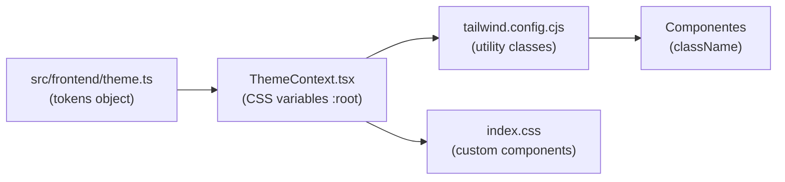

# Design Tokens

Referência formal dos tokens do design system Nexus-Arqui.

**Fonte de verdade**: [`src/frontend/constants/theme.ts`](file:///c:/Users/gustavo.geraldo/Documents/05.%20Nexus-Arqui%20%28Beta%29/src/frontend/constants/theme.ts)
**Consumo**: [`ThemeContext.tsx`](file:///c:/Users/gustavo.geraldo/Documents/05.%20Nexus-Arqui%20%28Beta%29/src/frontend/context/ThemeContext.tsx) injeta CSS variables em `:root` (light) e `html.dark` (dark).
**Tailwind**: [`tailwind.config.cjs`](file:///c:/Users/gustavo.geraldo/Documents/05.%20Nexus-Arqui%20%28Beta%29/tailwind.config.cjs) mapeia CSS variables para classes utilitárias.

---

## Fluxo de Tokens

---

## 1. Colors

Valores HSL sem `hsl()` wrapper. CSS variable gerada: `--color-{name}`.
Tailwind class: `bg-{name}`, `text-{name}`, `border-{name}`.

### Light Theme

| Token               | HSL Value     | CSS Variable                | Tailwind Class               |
| ------------------- | ------------- | --------------------------- | ---------------------------- |
| `background`        | `39 33% 97%`  | `--color-background`        | `bg-background`              |
| `surface`           | `0 0% 100%`   | `--color-surface`           | `bg-surface`                 |
| `primary`           | `20 63% 34%`  | `--color-primary`           | `bg-primary`, `text-primary` |
| `primary-focus`     | `20 63% 25%`  | `--color-primary-focus`     | `bg-primary-focus`           |
| `primary-content`   | `0 0% 100%`   | `--color-primary-content`   | `text-primary-content`       |
| `secondary`         | `80 18% 30%`  | `--color-secondary`         | `bg-secondary`               |
| `secondary-focus`   | `80 18% 22%`  | `--color-secondary-focus`   | `bg-secondary-focus`         |
| `secondary-content` | `0 0% 100%`   | `--color-secondary-content` | `text-secondary-content`     |
| `accent`            | `31 93% 54%`  | `--color-accent`            | `bg-accent`                  |
| `accent-focus`      | `31 93% 48%`  | `--color-accent-focus`      | `bg-accent-focus`            |
| `text-primary`      | `20 6% 29%`   | `--color-text-primary`      | `text-text-primary`          |
| `text-secondary`    | `82 10% 55%`  | `--color-text-secondary`    | `text-text-secondary`        |
| `border-color`      | `35 33% 85%`  | `--color-border-color`      | `border-border-color`        |
| `success`           | `145 63% 34%` | `--color-success`           | `bg-success`, `text-success` |
| `warning`           | `38 92% 56%`  | `--color-warning`           | `bg-warning`, `text-warning` |
| `error`             | `0 72% 51%`   | `--color-error`             | `bg-error`, `text-error`     |
| `info`              | `200 88% 50%` | `--color-info`              | `bg-info`, `text-info`       |
| `violet`            | `259 59% 51%` | `--color-violet`            | _(sem Tailwind alias)_       |
| `shadow-rgb`        | `80, 91, 64`  | `--color-shadow-rgb`        | _(usado em shadows)_         |

### Dark Theme

| Token               | HSL Value     | CSS Variable                |
| ------------------- | ------------- | --------------------------- |
| `background`        | `80 15% 14%`  | `--color-background`        |
| `surface`           | `80 11% 20%`  | `--color-surface`           |
| `primary`           | `21 44% 58%`  | `--color-primary`           |
| `primary-focus`     | `21 44% 50%`  | `--color-primary-focus`     |
| `primary-content`   | `0 0% 100%`   | `--color-primary-content`   |
| `secondary`         | `20 63% 40%`  | `--color-secondary`         |
| `secondary-focus`   | `20 63% 30%`  | `--color-secondary-focus`   |
| `secondary-content` | `35 33% 85%`  | `--color-secondary-content` |
| `accent`            | `31 93% 60%`  | `--color-accent`            |
| `accent-focus`      | `31 93% 54%`  | `--color-accent-focus`      |
| `text-primary`      | `39 33% 97%`  | `--color-text-primary`      |
| `text-secondary`    | `82 10% 55%`  | `--color-text-secondary`    |
| `border-color`      | `80 18% 28%`  | `--color-border-color`      |
| `success`           | `145 58% 45%` | `--color-success`           |
| `warning`           | `38 92% 56%`  | `--color-warning`           |
| `error`             | `0 84% 60%`   | `--color-error`             |
| `info`              | `197 71% 73%` | `--color-info`              |
| `violet`            | `259 59% 65%` | `--color-violet`            |
| `shadow-rgb`        | `20, 20, 10`  | `--color-shadow-rgb`        |

---

## 2. Typography

| Token                  | Value                                             | CSS Variable              |
| ---------------------- | ------------------------------------------------- | ------------------------- |
| `fontFamily.sans`      | `'Segoe UI', Tahoma, Geneva, Verdana, sans-serif` | `--font-sans`             |
| `fontFamily.serif`     | `'Georgia', 'Times New Roman', serif`             | `--font-serif`            |
| `lineHeight.tight`     | `1.25`                                            | _(uso direto via tokens)_ |
| `lineHeight.normal`    | `1.5`                                             | _(uso direto via tokens)_ |
| `lineHeight.loose`     | `1.75`                                            | _(uso direto via tokens)_ |
| `letterSpacing.tight`  | `-0.025em`                                        | _(uso direto via tokens)_ |
| `letterSpacing.normal` | `0em`                                             | _(uso direto via tokens)_ |
| `letterSpacing.wide`   | `0.025em`                                         | _(uso direto via tokens)_ |

---

## 3. Spacing

Escala baseada em 4px (0.25rem). Usar via Tailwind (`p-{n}`, `m-{n}`, `gap-{n}`).

| Token | Value     | px equivalent |
| ----- | --------- | ------------- |
| `0`   | `0`       | 0px           |
| `1`   | `0.25rem` | 4px           |
| `2`   | `0.5rem`  | 8px           |
| `3`   | `0.75rem` | 12px          |
| `4`   | `1rem`    | 16px          |
| `5`   | `1.25rem` | 20px          |
| `6`   | `1.5rem`  | 24px          |
| `8`   | `2rem`    | 32px          |
| `10`  | `2.5rem`  | 40px          |
| `12`  | `3rem`    | 48px          |
| `16`  | `4rem`    | 64px          |
| `20`  | `5rem`    | 80px          |
| `24`  | `6rem`    | 96px          |
| `32`  | `8rem`    | 128px         |

> [!IMPORTANT]
> Usar SEMPRE a escala do design system (4, 8, 12, 16, 24, 32...). Espaçamento arbitrário como `margin: 13px` viola regra C.2 do AGENTS.

---

## 4. Border Radius

| Token  | Value      | CSS Variable         | Tailwind       |
| ------ | ---------- | -------------------- | -------------- |
| `none` | `0`        | —                    | `rounded-none` |
| `sm`   | `0.125rem` | —                    | `rounded-sm`   |
| `md`   | `0.375rem` | —                    | `rounded-md`   |
| `lg`   | `0.5rem`   | —                    | `rounded-lg`   |
| `xl`   | `1rem`     | `--border-radius-xl` | `rounded-xl`   |
| `full` | `9999px`   | —                    | `rounded-full` |

---

## 5. Shadows

| Token         | Value                                                             | CSS Variable           | Tailwind             |
| ------------- | ----------------------------------------------------------------- | ---------------------- | -------------------- |
| `soft`        | `0 4px 12px 0 rgba(var(--color-shadow-rgb), 0.07)`                | `--shadow-soft`        | `shadow-soft`        |
| `lifted`      | `0 10px 20px -5px rgba(..., 0.1), 0 4px 6px -2px rgba(..., 0.05)` | `--shadow-lifted`      | `shadow-lifted`      |
| `interactive` | `0 0 0 2px hsl(surface), 0 0 0 4px hsl(primary/0.5)`              | `--shadow-interactive` | `shadow-interactive` |
| `inner-soft`  | `inset 0 2px 4px 0 rgba(0,0,0,0.05)`                              | `--shadow-inner-soft`  | `shadow-inner-soft`  |

---

## 6. Z-Index

Escala hierárquica para controlar sobreposição de camadas.

| Token      | Value | Uso                          |
| ---------- | ----- | ---------------------------- |
| `hide`     | `-1`  | Elementos ocultos            |
| `base`     | `0`   | Nível padrão                 |
| `dropdown` | `10`  | Menus dropdown               |
| `sticky`   | `20`  | Headers fixos                |
| `overlay`  | `30`  | Overlays de fundo            |
| `modal`    | `40`  | Modais                       |
| `popover`  | `50`  | Popovers/tooltips flutuantes |
| `toast`    | `60`  | Notificações toast           |
| `tooltip`  | `70`  | Tooltips (maior prioridade)  |

---

## 7. Transitions

| Token      | Value                          |
| ---------- | ------------------------------ |
| `duration` | `200ms`                        |
| `timing`   | `cubic-bezier(0.4, 0, 0.2, 1)` |

---

## Regras de Uso

1. **Cores hardcoded proibidas** (regra C.1): usar sempre tokens via CSS variables ou Tailwind classes.
2. **Exceção**: ícones de brands (Instagram, Facebook, etc.) podem usar cores oficiais da marca em SVG.
3. **Espaçamento na escala** (regra C.2): sempre usar valores da escala de spacing.
4. **Theming**: todas as cores respondem automaticamente a `light`/`dark` via `ThemeContext`.
